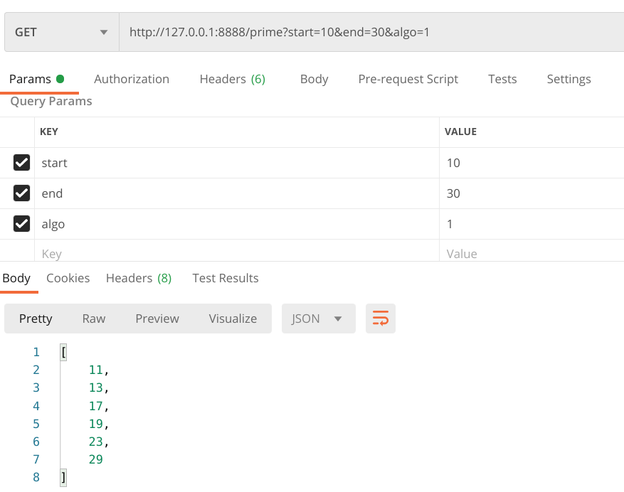

# Prime Generator

Get prime numbers in the given range.

1. Prime_Server is a console application which can be used to generate prime numbers in the given range.
2. Prime_Generator_API is RESTful API, written in Node.js to provide prime numbers in the given range.

## 1. Prime_Server

As already mentioned, it is a console application for generating prime numbers in the given range.
User can install the node package using ```npm install -g .``` and can access the application using terminal by typing
```primegenerator``` command. I have implemented 3 algorithms for computing the prime numbers in the given range in javascript.

* Naive algorithm
* Sieve of Eratosthenes
* Segmented Sieve

User can select any of the above algorithm for the computation based on the input range. I have used ```chalk``` package of npm to make console output colorful anf beautiful.


## 2. Prime_Generator_API

This is a simple RESTful API, devloped using Node.js. The algorithms used for generating prime numbers in the given range are same as mentioned above. Following are the dependencies:

* Express Framework for handling HTTP requests and responses.
* sqlite3 as a database
* morgan (HTTP request logger middleware)
* performance-now for measuring the execution time of the code

The API has two end points ```/prime and /view```. The ```/prime``` end point have 3 parameters start,end and algo which can be used to compute prime numbers in the range [start,end] using algorithm specified by ```algo``` parameter. The algo parameter can take value 1,2 or 3. If algo = 1 then naive algorithm will be used for computation and so on. The API allows ```GET``` as well as ```POST``` request for this end point.

For example ```localhost:8888/prime?start=10&end=30&algo=3``` will return prime numbers in range [10,30] using segmented sieve algorithm.



As computation can last for a long time depending on the input, therefore it will block the main thread. The API will not able to process the incoming requests in the mean time. To solve this problem I have used ```worker_threads``` which is used to generate new thread each time the API is called for computation. After computation the result is again passed to the main thread and then sent to the client in JSON format. After every computation, the current timestamp, start, end, time elapsed, algorithm used, number of primes returned is stored in sqlite database in the USERS table.

```/view``` end point will return the entire content of the USER table.


